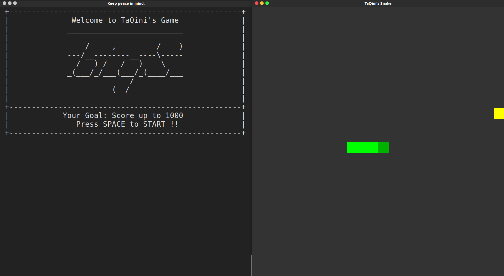
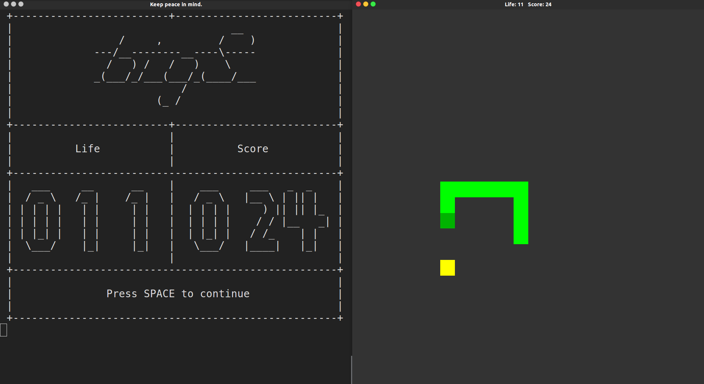

# BigS
A sample *snake eat bean* game write in c++ &amp; openGL

## Rule of the GAME
 - Your have 5 life at begining.
 - You can control `BigS`, the Snake to eat colorful `Beans` to gain score.
 - If you crash yourself or the wall, you will lost 1 life.
 - When your life is 0, **GAMEOVER**.

## Something else
 - While you crash yourself, you can pass yourself.
 - While you crash the wall, you can change move direction to continue.
 - The life will keep losting while you crash the wall, so please move away quickly.

## Control
 - Up/W Down/S Left/A Right/D to MOVE
 - Space to PAUSE
 - Esc to EXIT
 - there are some special key to open hidden mode :)

## SreenShot
### Start Page of Game
 
### Playing
 

TaQini
2017.6.8
